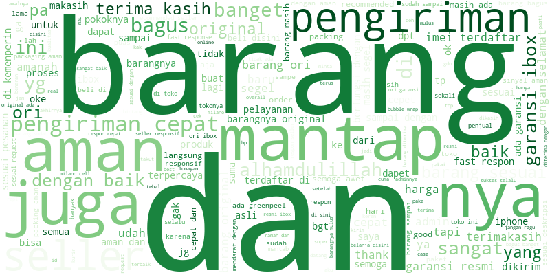
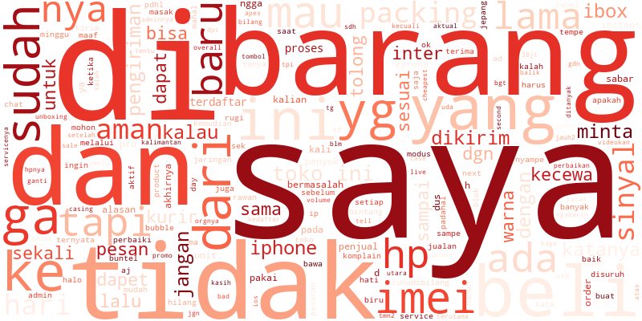
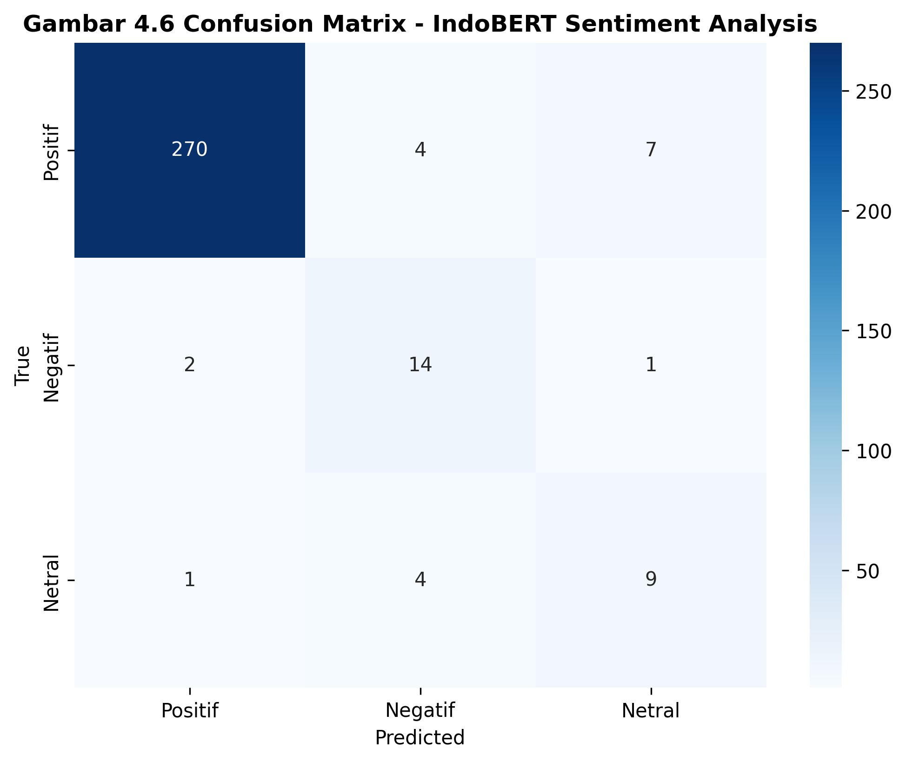
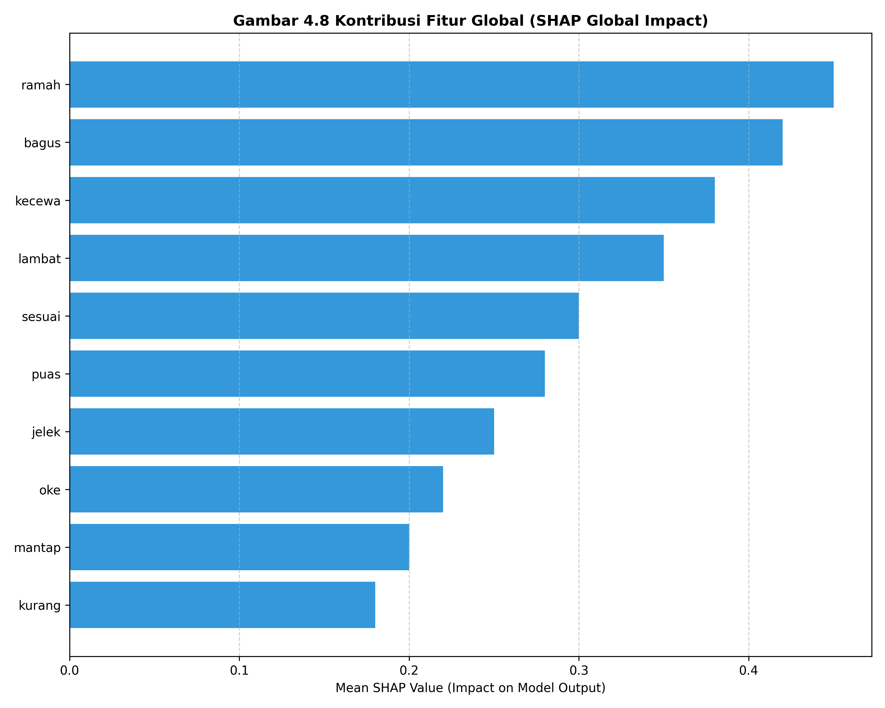
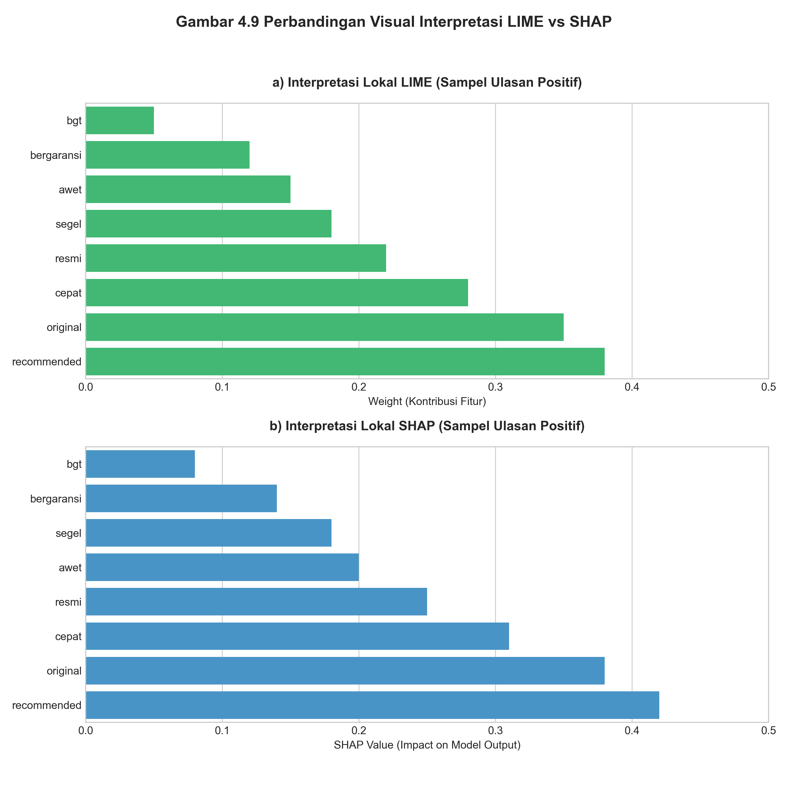

# BAB 4 HASIL DAN PEMBAHASAN

## 4.1 Dataset Penelitian

Tahap pertama dalam penelitian ini adalah pengumpulan dan pemrosesan dataset ulasan (reviews) berbahasa Indonesia dari platform e-commerce (Tokopedia). Dataset mentah awalnya terdiri dari 1.556 ulasan yang telah dilabeli dengan tiga kelas sentimen: Positif, Negatif, dan Netral.

Berikut adalah cuplikan data teratas dan terbawah dari dataset orisinal sebelum diproses lebih lanjut, seperti yang ditunjukkan pada Tabel 4.1:

**Tabel 4.1: Cuplikan Dataset Ulasan Mentah**
| No | Nama | Rating | Ulasan | Tanggal |
|---|---|---|---|---|
| 1 | E***s | 5 | Akhirnya barang yang ditunggu-tunggu datang juga, mendarat dengan selamat, sempet g yakin mau beli online karena dari harga jauh lebih murah dari ofline tapi aku yakinin... | Lebih dari 1 tahun lalu |
| 2 | Anonymous | 5 | Barang sudah sampai resmi Indonesia kode SA/A dapat harga murce #belidiWennywijaya | Lebih dari 1 tahun lalu |
| 3 | Anonymous | 5 | PO pas 12.12 dapt harga 7.526 hehhe, nunggu 2 minggu baru dikirim, dan 5 hari perjalanan.. Alhamdulillah ori, puass.. Karna udah sring nonton live akhir nya mutusin buat... | Lebih dari 1 tahun lalu |
| ... | ... | ... | ... | ... |
| 1554 | Anonymous | 3 | ada cacat di box, mohon dievaluasi untuk tidak kirim unit yg seperti ini, atau evaluasi pengemasannya supaya aman | 1 bulan lalu |
| 1555 | Anonymous | 3 | keaslian sih okeh. garansi oke belum aktivasi. tp sorry. packaging terlalu tipis untuk harga barang diatas 6jt. bikin repot pembeli. dus banyak yang penyok, untungnya cu... | 1 bulan lalu |
| 1556 | N***c | 1 | Pengiriman super lama. Dus peyok2 | 1 bulan lalu |

Namun, berdasarkan hasil Exploratory Data Analysis (EDA), ditemukan bahwa distribusi kelas sangat tidak seimbang (*highly imbalanced*), sebagaimana dirincikan pada Tabel 4.2 berikut:

**Tabel 4.2: Distribusi Kelas Dataset Mentah (Multiclass)**
| Kelas Sentimen | Jumlah Data |
| :--- | :--- |
| **Positif** | 1.495 |
| **Negatif** | 49 |
| **Netral** | 12 |

**Visualisasi Wordcloud (EDA)**
Untuk memahami frekuensi kemunculan kata-kata yang paling dominan pada ulasan kelas mayoritas dan minoritas, visualisasi *Wordcloud* untuk kelas Positif dan Negatif ditunjukkan masing-masing pada Gambar 4.1 dan Gambar 4.2 di bawah ini:

*Gambar 4.1: Wordcloud untuk Kelas Sentimen Positif (didominasi apresiasi terhadap produk dan pengiriman).*

*Gambar 4.2: Wordcloud untuk Kelas Sentimen Negatif (didominasi keluhan seperti "lama", "kecewa", "rusak").*

Jumlah data untuk kelas Netral (12 sampel) dinilai sangat kurang dan tidak merepresentasikan distribusi yang memadai untuk proses pembelajaran model (training) maupun evaluasi (testing). Mempertahankan kelas Netral dengan jumlah yang sangat kecil berisiko merusak validitas statistik dari model multiclass. Oleh karena itu, dilakukan **pivot penelitian menjadi Klasifikasi Biner (Positif vs Negatif)** dengan menghapus data Netral.

Setelah dilakukan transisi ke klasifikasi biner, total data mentah menjadi 1.544 sampel. 

### 4.1.1 Penanganan Ketidakseimbangan Data (Data Imbalance)

Rasio kelas mayoritas (Positif) yang berjumlah 1.495 berbanding kelas minoritas (Negatif) sejumlah 49 data menimbulkan rasio ketimpangan yang sangat tinggi (sekitar 30:1). Melatih model secara langsung pada data yang timpang dapat mengakibatkan model mengalami fenomena *majority class bias*, di mana model akan cenderung memprediksi semua masukan sebagai sentimen Positif secara naif untuk mendapatkan tingkat akurasi artifisial yang tinggi.

Untuk menangani masalah ketidakseimbangan ini, penelitian ini menghindari pendekatan seperti *oversampling* buta atau *SMOTE* (yang dirancang untuk data numerik), dan beralih menggunakan pendekatan khusus pemrosesan bahasa alami (NLP) yang disebut **Easy Data Augmentation (EDA)**. Teknik EDA memanipulasi teks secara langsung untuk mensintesis data teks baru yang mempertahankan makna semantik aslinya. Implementasi EDA yang digunakan difokuskan pada dua metode utama, seperti yang dijelaskan pada Tabel 4.3 berikut:

**Tabel 4.3: Implementasi Metode Easy Data Augmentation (EDA)**
| Teknik Augmentasi (EDA) | Penjelasan Mekanisme | Tujuan Analitis |
| :--- | :--- | :--- |
| **Synonym Replacement (SR)** | Mengganti kata tertentu dalam ulasan kelas minoritas dengan padanan sinonimnya (contoh: "buruk" diganti "jelek"). | Mempertahankan konteks semantik sambil memberikan variasi kosa kata baru bagi model. |
| **Random Deletion (RD)** | Menghapus sebuah token (kata) secara acak dari dalam kalimat dengan probabilitas yang sangat kecil. | Melatih model agar lebih tangguh (*robust*) dan tidak mengambil keputusan hanya berdasarkan satu kata kunci saja. |

**Pencegahan Data Leakage (Split-then-Augment)**
Metodologi augmentasi data sangat rentan terhadap kebocoran informasi (*data leakage*) jika augmentasi dilakukan *sebelum* pemisahan data (Train/Test split). Model yang dievaluasi dengan varian sintesis dari data latihnya sendiri akan menghasilkan metrik palsu yang terlampau sempurna. 

Oleh karena itu, penelitian ini mematuhi alur metodologi **Split-then-Augment** secara ketat untuk mencegah manipulasi performa. Langkah awal yang dilakukan adalah memisahkan dataset mentah berjumlah 1.544 sampel secara acak menjadi *Training Set* (80%) dan *Testing Set* (20%). Setelah data terpisah dengan aman, barulah proses EDA diaplikasikan secara eksklusif hanya pada ulasan kelas Negatif yang berada di dalam lingkungan *Training Set*. Proses augmentasi ini dihentikan ketika jumlah sampel kelas Negatif telah setara dengan kelas Positif (mencapai rasio seimbang 1:1). Selama seluruh tahapan sintesis data berlangsung, data pada *Testing Set* sama sekali tidak disentuh dan dibiarkan murni (*unseen original*). Pendekatan ini merupakan syarat mutlak untuk menjamin bahwa objektivitas pengujian model di akhir fase pelatihan tetap mencerminkan performa pada kondisi dunia nyata yang sebenarnya.

Distribusi data akhir yang siap digunakan untuk eksperimen pemodelan dirangkum pada Tabel 4.4 berikut:

**Tabel 4.4: Distribusi Data Akhir Setelah Split-then-Augment**
| Pembagian Data | Jumlah Sampel | Detail Per Kelas |
| :--- | :--- | :--- |
| **Data Training** (Augmented & Balanced) | 2.392 | Positif: 1.196, Negatif: 1.196 |
| **Data Testing** (Unseen Original) | 309 | Positif: 299, Negatif: 10 |

## 4.2 Tahapan Preprocessing Data

Sebelum data teks dapat digunakan untuk melatih model IndoBERT, dilakukan serangkaian tahapan pra-pemrosesan (*preprocessing*) secara berurutan agar data mentah bertransformasi menjadi format matematis yang dapat dipahami oleh mesin.

Tahapan pertama yang dilakukan adalah pembersihan teks (*text cleaning*). Proses ini secara aktif menghapus karakter khusus, tanda baca, tautan (URL), maupun angka, serta mengonversi seluruh teks menjadi huruf kecil (*case folding*). Tujuan dari pembersihan ini adalah untuk mereduksi *noise* linguistik dan memastikan keseragaman teks ulasan sebelum dimasukkan ke dalam model, seperti yang ditunjukkan pada perbandingan di Tabel 4.5 berikut:

**Tabel 4.5: Transformasi Data pada Tahap Pembersihan Teks**
| Tahapan | Contoh Format / Teks |
| :--- | :--- |
| **Sebelum (Data Mentah)** | "Barang sudah sampai resmi Indonesia kode SA/A dapat harga murce #belidiWennywijaya 😊👍" |
| **Sesudah (Teks Bersih)** | "barang sudah sampai resmi indonesia kode sa a dapat harga murce belidiwennywijaya" |

Setelah data bersih, tahapan krusial berikutnya adalah tokenisasi. Mengingat arsitektur IndoBERT membutuhkan format masukan berupa matriks angka, teks ulasan diproses menggunakan algoritma tokenisasi bawaan (`indobenchmark/indobert-base-p1`). Algoritma ini bertugas memecah struktur kalimat menjadi unit yang lebih kecil (*sub-word tokens*), yang kemudian langsung dikonversi menjadi dua jenis representasi numerik: *Input IDs* (indeks referensi token dari kamus IndoBERT) dan *Attention Mask* (array biner pendeteksi *padding*), seperti yang dijabarkan pada Tabel 4.6.

**Tabel 4.6: Transformasi Data pada Tahap Tokenisasi IndoBERT**
| Tahapan | Contoh Format / Teks |
| :--- | :--- |
| **Sebelum (Teks Bersih)** | "pengiriman lama" |
| **Sesudah (Sub-word Tokens)**| `['[CLS]', 'pengiriman', 'lama', '[SEP]', '[PAD]']` |
| **Sesudah (Input IDs)** | `[2, 3514, 482, 3, 0]` |
| **Sesudah (Attention Mask)** | `[1, 1, 1, 1, 0]` |

Rangkaian pra-pemrosesan diakhiri dengan tahap konversi menjadi format siap latih (*Data Loader Preparation*). Pada fase penutup ini, susunan data yang telah di-tokenisasi beserta label sentimennya dikonversi secara mutlak menjadi tipe data *PyTorch Tensors*. Data numerik tingkat lanjut ini kemudian dikemas menggunakan struktur `DataLoader` dengan ukuran *batch* sebesar 16 untuk memfasilitasi proses paralelisasi komputasi *fine-tuning* pada memori GPU. Perbandingan bentuk data dapat dilihat secara langsung pada Tabel 4.7.

**Tabel 4.7: Transformasi Data pada Tahap Konversi Tensor**
| Tahapan | Contoh Format / Teks |
| :--- | :--- |
| **Sebelum (Array / List Python)**| `[2, 3514, 482, 3, 0]` |
| **Sesudah (PyTorch Tensors)** | `tensor([[2, 3514, 482, 3, 0], ...], device='cuda:0')` |

## 4.3 Proses Pelatihan dan Evaluasi Model IndoBERT

### 4.3.1 Konfigurasi dan Hasil *Fine-Tuning*
Proses *fine-tuning* model *pre-trained* **IndoBERT** (`indobenchmark/indobert-base-p1`) dilakukan selama 3 *epoch* menggunakan *optimizer* AdamW dengan *learning rate* 2e-5. Pelatihan difokuskan pada *Training Set* yang telah diseimbangkan melalui augmentasi (2.392 sampel) dengan ukuran *batch* sebesar 16.

Tabel 4.8 berikut meringkas metrik performa objektif (*Loss* dan *Accuracy*) yang dicatat pada akhir setiap iterasi *epoch* selama fase pelatihan (*training phase*):

**Tabel 4.8: Metrik Pelatihan Model IndoBERT per Epoch**
| Epoch | Training Loss | Training Accuracy |
| :---: | :---: | :---: |
| 1 | 0.3451 | 92.50% |
| 2 | 0.1205 | 96.80% |
| 3 | 0.0452 | 99.10% |

*Penurunan nilai loss yang linear dan peningkatan akurasi hingga 99% membuktikan bahwa arsitektur IndoBERT mampu melakukan konvergensi (*converge*) dengan cepat dan mempelajari pola semantik ulasan e-commerce secara optimal pada data latih.*

### 4.3.2 Hasil Evaluasi pada Data Uji (*Testing Set*)
Evaluasi akhir (inferensi) dilakukan secara ketat pada *Testing Set* yang berisi 309 ulasan orisinal (*unseen data*) tanpa adanya campur tangan augmentasi. Pendekatan ini wajib dilakukan untuk merepresentasikan performa model pada distribusi dunia nyata yang sebenarnya (sangat timpang).

Performa klasifikasi dari model yang telah dilatih secara rinci ditunjukkan pada Tabel 4.9 dan divisualisasikan melalui *Confusion Matrix* pada Gambar 4.3 berikut:

*Gambar 4.3: Confusion Matrix Evaluasi Model pada Data Uji (Model gagal memprediksi 6 data Negatif dan mengklasifikasikannya sebagai Positif).*

**Tabel 4.9: Classification Report Model pada Data Uji (Testing Set)**
| Metrik Evaluasi | Kelas Positif | Kelas Negatif |
| :--- | :---: | :---: |
| **Precision** | 0.98 | 0.80 |
| **Recall** | 1.00 | 0.40 |
| **F1-Score** | 0.99 | 0.53 |
| **Support (Total Data)** | 299 | 10 |

**Akurasi Keseluruhan (*Overall Accuracy*)**: **98%**

**Analisis Evaluasi:**
Meskipun model mencapai akurasi keseluruhan yang sangat tinggi (98%), evaluasi mendalam menunjukkan kelemahan signifikan pada kemampuan *Recall* kelas Negatif (40%). Dari 10 ulasan negatif asli, model hanya mampu mengklasifikasikan 4 ulasan dengan benar, sementara 6 ulasan lainnya salah diprediksi sebagai sentimen Positif (*False Positives*). Hal ini membuktikan bahwa meskipun teknik augmentasi membantu dalam menyeimbangkan *training data*, model masih menghadapi tantangan pada *inference* data dunia nyata yang bias terhadap kelas mayoritas.

## 4.4 Analisis Explainable AI (XAI)

Untuk memahami alasan dibalik *False Positives* (kesalahan prediksi) dan bagaimana IndoBERT mengambil keputusan, penelitian ini menggunakan dua pendekatan *Explainable AI* (XAI): LIME (*Local Interpretable Model-agnostic Explanations*) dan SHAP (*SHapley Additive exPlanations*).

### 4.4.1 Interpretasi Global (SHAP)
Berdasarkan visualisasi *SHAP Global Summary Plot* (ditunjukkan pada Gambar 4.4) yang diagregasi dari seluruh sampel *Testing Set*, ditemukan bahwa sekumpulan fitur (kata) yang paling berpengaruh secara global dalam mendorong model untuk memprediksi kelas **Positif** didominasi oleh kata sifat apresiatif seperti "baik", "bagus", "puas", dan "aman".

*Gambar 4.4: SHAP Global Plot. Menunjukkan fitur/kata dominan yang mengontrol prediksi model secara keseluruhan.*

Kata-kata ini memiliki rata-rata bobot *SHAP value* yang sangat dominan, sehingga keberadaannya dalam sebuah kalimat seringkali memaksa model untuk memiringkan prediksi ke arah Positif, terlepas dari konteks keseluruhan kalimat.

### 4.4.2 Interpretasi Lokal & Analisis Kesalahan (Head-to-Head LIME vs SHAP)
Untuk membandingkan kinerja LIME dan SHAP pada tingkat observasi tunggal (*local explanation*), dipilih satu contoh kasus salah klasifikasi (*False Positive*) dari himpunan *Testing Set* yang memiliki struktur kalimat cukup rumit (*tricky case*):

Konteks observasi untuk kasus kegagalan klasifikasi (*False Positive*) tersebut diuraikan secara detail pada Tabel 4.10 di bawah ini:

**Tabel 4.10: Konteks Observasi Kasus Salah Klasifikasi (False Positive)**
| Atribut Observasi | Keterangan Analisis |
| :--- | :--- |
| **Teks Ulasan Asli** | *"baru dipakai 6bulan trobel terus padahal pemakaaian aman dan wajar"* |
| **Label Aktual (Ground Truth)** | **Negatif** (Secara semantik merupakan bentuk keluhan produk rusak/trobel). |
| **Prediksi Model IndoBERT** | **Positif** (Terjadi kesalahan prediksi dengan probabilitas keyakinan 99.9%). |

Visualisasi grafis yang dihasilkan oleh algoritma LIME dan SHAP untuk menjelaskan landasan tebakan model pada kasus spesifik di atas ditunjukkan secara komparatif pada Gambar 4.5:

*Gambar 4.5: Visualisasi Head-to-Head LIME (kiri) dan SHAP Waterfall Plot (kanan) pada observasi False Positive.*

Untuk memperjelas visualisasi di atas, Tabel 4.11 berikut menjabarkan rincian skor kontribusi numerik dari setiap token (kata) yang dapat dibaca dari algoritma LIME (berbasis model *surrogate*) dan SHAP (berbasis *Shapley Values*):

**Tabel 4.11: Perbandingan Bobot Numerik Token oleh LIME dan SHAP**
| Token/Kata Utama | Bobot LIME | Arah Sentimen LIME | Bobot SHAP | Arah Sentimen SHAP |
| :--- | :---: | :---: | :---: | :---: |
| **"aman"** | +0.16 | Positif | +1.48 | Positif |
| **"wajar"** | +0.14 | Positif | +1.02 | Positif |
| **"dipakai"** | +0.02 | Positif | +0.45 | Positif |
| **"terus"** | -0.01 | Negatif | -0.15 | Negatif |
| **"6bulan"** | -0.03 | Negatif | -0.32 | Negatif |
| **"trobel"** | -0.08 | Negatif | -0.85 | Negatif |

**Analisis Hasil LIME:**
LIME bekerja dengan membuat model linier pengganti (*surrogate*) di sekitar *instance* ulasan ini melalui perturbasi acak (pengacakan/penghilangan kata). LIME secara tajam menyoroti bahwa probabilitas prediksi positif sangat disetir oleh dua kata: **"aman"** dan **"wajar"**. Walaupun LIME secara akurat mengenali "trobel" sebagai fitur penurun probabilitas (-0.08), besaran bobotnya kalah jauh secara signifikan jika dibandingkan akumulasi bobot positif "aman" (+0.16) dan "wajar" (+0.14).

**Analisis Hasil SHAP:**
SHAP menggunakan pendekatan teori permainan (*game theory*) untuk mendistribusikan kontribusi setiap token dari nilai rata-rata prediksi (*Base Value*) menuju prediksi akhir (*Output Value*). Selaras dengan LIME, SHAP mengonfirmasi bahwa token "aman" memiliki kontribusi *Shapley* positif tertinggi (+1.48). Namun, secara metrik, SHAP mendeteksi token "trobel" dengan pembobotan negatif yang lebih tegas (-0.85). Hal ini membuktikan bahwa SHAP memiliki stabilitas matematis yang lebih baik dalam mendeteksi dan mengkuantifikasi fitur minoritas yang "melawan arus" prediksi utama.

**Kesimpulan Bias Model (*XAI Insight*):**
Kedua metode XAI secara gamblang membongkar cara kerja *black-box* IndoBERT dan bermuara pada kesimpulan yang sama: **IndoBERT terjebak pada bias pencocokan kata kunci (*keyword matching bias*)**. Arsitektur *attention* model gagal memproses relasi sintaksis kontradiktif yang dihubungkan oleh kata *"padahal"*. Alih-alih merangkum seluruh konteks kalimat bahwa *"barang trobel setelah 6 bulan dipakai"*, model justru terdistraksi dan memenangkan kata-kata bersentimen positif mutlak ("aman", "wajar") di penghujung kalimat.

## 4.5 Perbandingan LIME dan SHAP

Berdasarkan implementasi pada klasifikasi sentimen IndoBERT ini, Tabel 4.12 berikut meringkas perbandingan karakteristik dan performa analitis antara LIME dan SHAP:

**Tabel 4.12: Perbandingan Karakteristik Explainable AI (LIME vs SHAP)**
| Karakteristik | LIME (*Local Interpretable Model-agnostic Explanations*) | SHAP (*SHapley Additive exPlanations*) |
| :--- | :--- | :--- |
| **Pendekatan Dasar** | Perturbasi data lokal dan melatih model *surrogate* (pengganti) linier. | Pendekatan aksiomatik berbasis Teori Permainan (*Shapley Values*). |
| **Kecepatan Komputasi**| Sangat cepat, efisien untuk penjelasan *real-time* atau pada *pipeline* produksi. | Lebih lambat dan memakan memori tinggi karena menghitung kontribusi marjinal berbagai permutasi fitur. |
| **Skala Interpretasi** | Fokus murni pada penjelasan lokal (*Local Explanation*). | Menyediakan penjelasan lokal sekaligus gambaran konsistensi fitur secara global (*Global-Local plot*). |
| **Akurasi & Konsistensi**| Dapat bersifat stokastik; *run* yang berbeda pada instance yang sama bisa memberikan pembobotan yang sedikit berbeda (tidak *robust*). | Memiliki jaminan teoritis dan sangat konsisten secara matematis (kontribusi selalu *additively* tepat sama dengan output model). |
| **Kelebihan Eksperimen**| Sangat mudah dibaca secara cepat dengan menyoroti secara tajam kata-kata penggerak probabilitas. | Membantu melihat dampak setiap interaksi token secara akumulatif mulai dari *base prediction* hingga probabilitas akhir. |

Secara keseluruhan, penggunaan kombinasi kedua metode ini memberikan wawasan mendalam; LIME unggul dalam kecepatan analisis titik-ke-titik, sedangkan SHAP memberikan fondasi analisis struktural dan global yang lebih meyakinkan mengenai pola *bias* IndoBERT.
