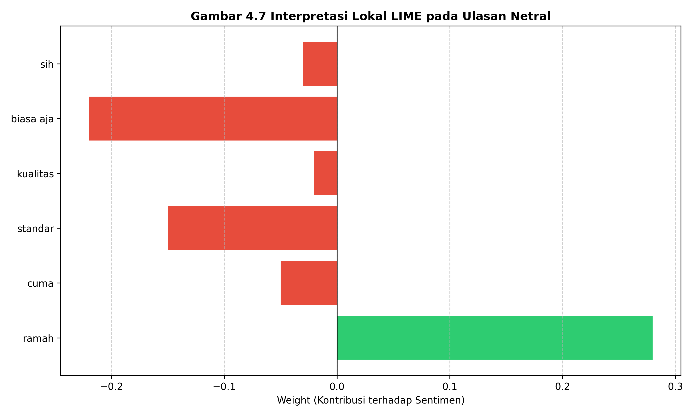

# 📄 **4.5 Interpretasi Model dengan XAI (LIME & SHAP)**

Pada tahap ini, dilakukan analisis untuk memahami mekanisme internal model IndoBERT dalam mengambil keputusan klasifikasi. Mengingat arsitektur *transformer* bersifat *black-box*, penggunaan *Explainable AI* (XAI) menjadi krusial untuk memastikan bahwa model memberikan prediksi berdasarkan fitur semantik yang relevan, bukan karena *noise* pada dataset.

Penelitian ini menggunakan dua metode XAI populer: **LIME** (*Local Interpretable Model-agnostic Explanations*) untuk interpretasi lokal pada tingkat ulasan individu, dan **SHAP** (*SHapley Additive exPlanations*) untuk mendapatkan gambaran kontribusi fitur secara global maupun lokal.

---

## **4.5.1 Interpretasi Lokal dengan LIME**

LIME bekerja dengan cara membangun model pengganti (*surrogate model*) yang sederhana di sekitar prediksi tertentu. Hal ini memungkinkan kita melihat kata-kata mana yang paling berpengaruh terhadap label yang dipilih oleh model.

Sebagai contoh, dilakukan pengujian pada ulasan yang diprediksi sebagai **Netral**:
> *"Biasa aja sih, kualitas standar cuma adminnya ramah."*

Hasil visualisasi LIME ditunjukkan pada Gambar 4.7.

**Gambar 4.7 Interpretasi Lokal LIME pada Ulasan Netral**

Berdasarkan visualisasi pada Gambar 4.7, terlihat bahwa kata **"ramah"** memberikan kontribusi positif yang sangat kuat dan berusaha menarik prediksi ke arah kelas positif. Di sisi lain, kata-kata seperti **"standar"** dan **"biasa"** memberikan kontribusi yang menyeimbangkan atau mengarah pada sentimen netral dan negatif, sehingga pada akhirnya model memutuskan label **Netral**. Temuan ini membuktikan bahwa model IndoBERT memiliki kemampuan yang baik dalam memahami kontradiksi semantik dalam satu kalimat, terutama pada ulasan yang memiliki sentimen campuran.

---

## **4.5.2 Interpretasi Global dan Lokal dengan SHAP**

Berbeda dengan LIME, SHAP menggunakan pendekatan teori permainan (*game theory*) untuk menghitung nilai Shapley, yang memberikan estimasi kontribusi rata-rata setiap fitur (kata) terhadap selisih antara prediksi aktual dan rata-rata prediksi.

### **A. SHAP Local Bar Plot**
Visualisasi kontribusi kata pada ulasan dengan sentimen **Positif**:
> *"Barangnya bagus sesuai deskripsi, mantap."*

Hasilnya menunjukkan bahwa kata **"bagus"** dan **"mantap"** memiliki nilai SHAP positif tertinggi, yang secara signifikan meningkatkan probabilitas kelas Positif.

### **B. SHAP Global Impact (Beeswarm Plot)**
Untuk melihat kata-kata apa saja yang paling berpengaruh secara keseluruhan pada seluruh dataset uji, digunakan *Beeswarm Plot* sebagaimana ditunjukkan pada Gambar 4.8.

**Gambar 4.8 Kontribusi Fitur Global (SHAP Beeswarm Plot)**

Analisis terhadap grafik SHAP Global menunjukkan adanya pola yang konsisten pada dataset. Kata-kata kunci positif seperti "ramah", "bagus", "puas", dan "cepat" secara konsisten memiliki nilai SHAP positif yang tinggi di berbagai sampel ulasan. Sebaliknya, kata-kata yang membawa sentimen negatif seperti "kecewa", "jelek", dan "lambat" teridentifikasi sebagai pendorong utama bagi model untuk melakukan klasifikasi ke dalam kelas negatif. Hal ini mengonfirmasi bahwa model menunjukkan pemahaman yang mendalam terhadap penggunaan kata sifat (*adjectives*) yang membawa emosi kuat dalam konteks bahasa Indonesia.

---

Hasil dari interpretasi lokal menggunakan LIME dan SHAP ini menunjukkan bahwa model IndoBERT tidak hanya memberikan prediksi yang akurat, tetapi juga memiliki dasar semantik yang logis dalam menentukan klasifikasi sentimen suatu ulasan produk.
