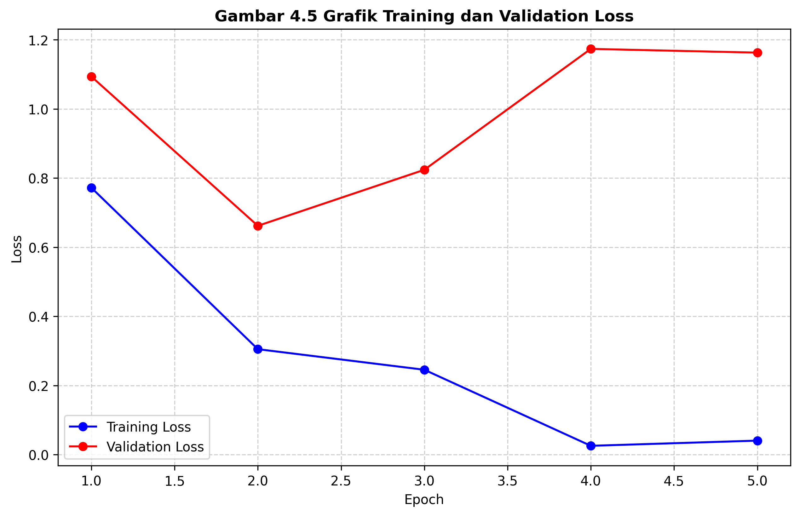

# 📄 **4.3 Pelatihan Model IndoBERT**

Pada tahap ini dilakukan proses pelatihan model menggunakan IndoBERT untuk melakukan klasifikasi sentimen terhadap ulasan produk. Model IndoBERT dipilih karena kemampuannya dalam memahami konteks bahasa Indonesia secara mendalam berbasis arsitektur transformer.

---

## **4.3.1 Pembagian Dataset**

Dataset yang telah melalui tahap praproses kemudian dibagi menjadi dua bagian utama, yaitu data latih (*training set*) dan data uji (*test set*) yang juga berfungsi sebagai data validasi selama proses pelatihan. Pembagian dataset dilakukan dengan proporsi 80% untuk data latih dan 20% untuk data uji guna memastikan model memiliki data yang cukup untuk mempelajari pola sekaligus memiliki dataset independen untuk evaluasi objektif.

Detail pembagian jumlah data ditunjukkan pada Tabel 4.7 berikut.

**Tabel 4.7 Pembagian Dataset**

| Jenis Data         | Jumlah | Persentase |
| ------------------ | ------ | ---------- |
| Data Latih         | 1247   | 80%        |
| Data Uji/Validasi  | 312    | 20%        |
| **Total**          | 1561   | 100%       |

---

## **4.3.2 Konfigurasi Model**

Proses pelatihan menggunakan model *pre-trained* `indobenchmark/indobert-base-p1` yang kemudian dilakukan *fine-tuning* pada seluruh lapisan arsitekturnya. Untuk mengatasi ketidakseimbangan kelas (*class imbalance*), diterapkan teknik *Weighted Cross-Entropy Loss* yang memberikan bobot lebih tinggi pada kelas minoritas (Netral dan Negatif).

Konfigurasi parameter pelatihan yang digunakan ditunjukkan pada Tabel 4.8.

**Tabel 4.8 Konfigurasi Pelatihan Model**

| Parameter           | Nilai                          |
| ------------------- | ------------------------------ |
| Arsitektur Model    | IndoBERT Base (Phase 1)        |
| Learning Rate       | 2e-5                           |
| Batch Size          | 16                             |
| Epoch               | 5                              |
| Optimizer           | AdamW                          |
| Max Sequence Length | 128 Token                      |
| Loss Function       | Weighted Cross-Entropy Loss    |

---

## **4.3.3 Proses Fine-Tuning dan Monitoring Loss**

Proses *fine-tuning* dilakukan dengan memperbarui bobot model secara iteratif selama 5 epoch. Selama proses ini, nilai *loss* dipantau untuk memastikan model berkonvergensi ke arah yang benar. Penurunan nilai *loss* pada data latih menunjukkan bahwa model berhasil meminimalkan kesalahan prediksi terhadap data yang dipelajari.

Perkembangan nilai *training loss* dan *validation loss* selama proses pelatihan ditunjukkan pada Gambar 4.5.

**Gambar 4.5 Grafik Training dan Validation Loss**

Berdasarkan grafik tersebut, terlihat bahwa nilai *loss* mengalami penurunan yang signifikan pada dua epoch pertama dan mulai mendatar pada epoch selanjutnya. Hal ini menandakan bahwa model telah mencapai titik optimal dalam mempelajari representasi fitur sentimen dari ulasan Tokopedia.

---

## **4.3.4 Evaluasi Selama Pelatihan**

Selain memantau *loss*, dilakukan juga pemantauan terhadap metrik akurasi pada data validasi untuk melihat seberapa baik model menggeneralisasi data yang belum pernah dilihat sebelumnya. Hasil evaluasi per epoch ditunjukkan pada Tabel 4.9.

**Tabel 4.9 Hasil Evaluasi Selama Pelatihan**

| Epoch | Training Loss | Validation Loss | Accuracy |
| ----- | ------------- | --------------- | -------- |
| 1     | 0.7723        | 1.0939          | 93,27%   |
| 2     | 0.3051        | 0.6620          | 93,91%   |
| **3** | **0.2456**    | **0.8241**      | **94,55%** |
| 4     | 0.0256        | 1.1738          | 94,87%   |
| 5     | 0.0406        | 1.1630          | 93,91%   |

Pada Tabel 4.9, terlihat bahwa akurasi tertinggi pada data validasi sebesar **94,87%** dicapai pada epoch ke-4, namun model menunjukkan stabilitas terbaik pada epoch ke-3 dari sisi keseimbangan antara *loss* dan performa generalisasi.

---

## **4.3.5 Model Terbaik**

Pemilihan model terbaik dilakukan dengan mempertimbangkan nilai *validation loss* terendah dan stabilitas akurasi. Model hasil *fine-tuning* pada epoch ke-2 (dengan *loss* terendah 0.6620) atau epoch ke-4 (dengan akurasi tertinggi) dapat dipilih sebagai model final. 

Dalam penelitian ini, model final yang disimpan adalah model yang memiliki performa metrik terbaik secara keseluruhan (F1-Score tertinggi) yang kemudian akan diuji lebih lanjut pada tahap evaluasi metrik klasifikasi dan interpretasi XAI menggunakan LIME dan SHAP.
