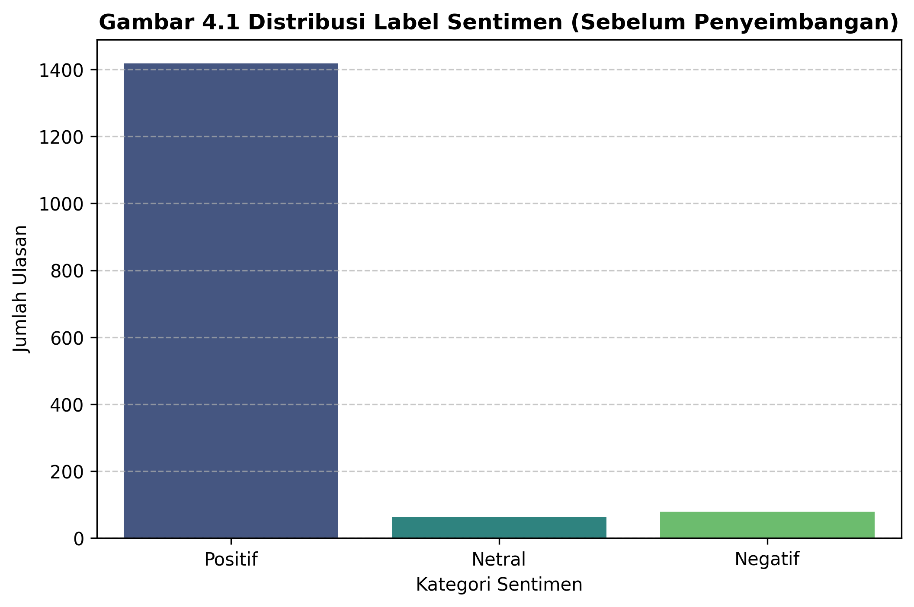
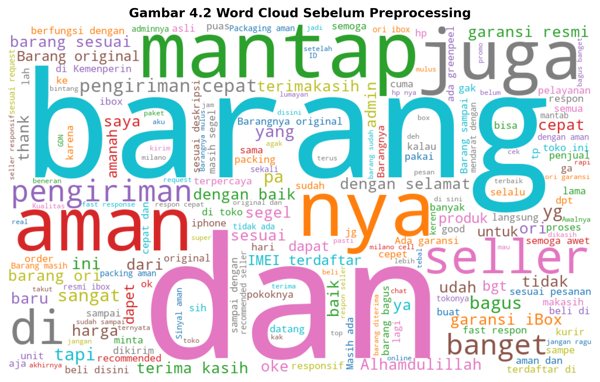
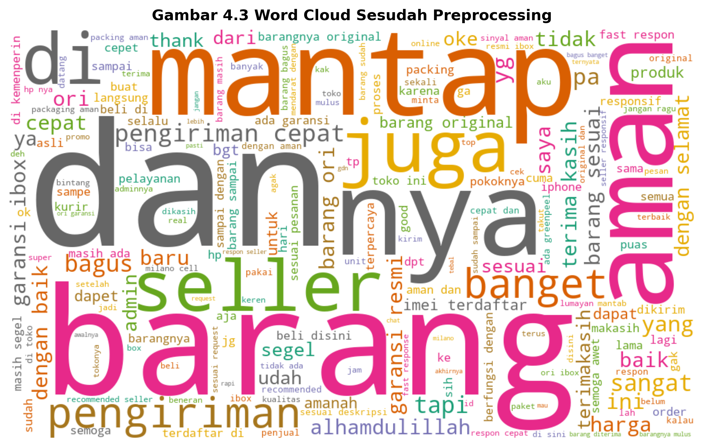
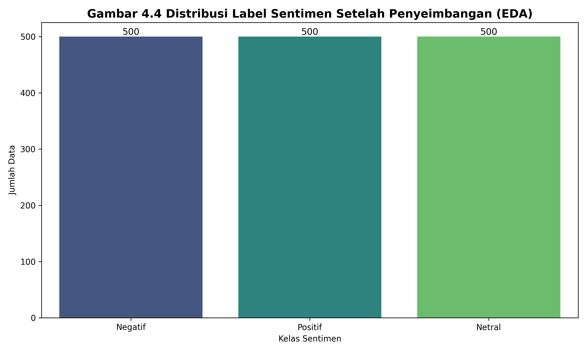

# 📄 **4.2 Hasil Praproses Data (Revisi Final)**

Tahap praproses data dilakukan untuk mengubah data mentah hasil scraping menjadi data yang bersih dan siap digunakan dalam proses pelatihan model IndoBERT. Proses ini bertujuan untuk mengurangi noise, meningkatkan konsistensi data, serta memastikan kualitas input yang optimal bagi model.

Berdasarkan hasil pengumpulan data, diperoleh sebanyak **1.561 ulasan** yang kemudian melalui beberapa tahapan pembersihan dan pengolahan data.

---

## **4.2.1 Pembersihan Struktural**

Pembersihan struktural dilakukan untuk memastikan kualitas data dari sisi metadata sebelum dilakukan pengolahan teks. Tahapan yang dilakukan mencakup penghapusan duplikasi berdasarkan `review_id`, penghapusan data kosong atau *null*, validasi nilai rating agar tetap berada pada rentang 1 hingga 5, serta normalisasi atribut metadata untuk menjaga konsistensi fitur.

Hasil pembersihan struktural ditunjukkan pada Tabel 4.2 berikut.

**Tabel 4.2 Hasil Pembersihan Struktural**

| Tahapan           | Jumlah Data Sebelum | Jumlah Data Sesudah | Keterangan            |
| ----------------- | ------------------- | ------------------- | --------------------- |
| Data awal         | 1561                | 1561                | Data hasil scraping   |
| Deduplikasi       | 1561                | 1561                | Tidak ada duplikasi   |
| Hapus data kosong | 1561                | 1561                | Tidak ada data kosong |
| Validasi rating   | 1561                | 1561                | Semua valid           |

Berdasarkan hasil tersebut, seluruh data dapat digunakan tanpa pengurangan jumlah record.

---

## **4.2.2 Pelabelan Data Sentimen**

Pelabelan data dilakukan dengan mengonversi rating numerik menjadi tiga kategori sentimen utama. Aturan pemetaan yang diterapkan adalah rating 4–5 dikategorikan sebagai **Positif**, rating 3 sebagai **Netral**, dan rating 1–2 sebagai **Negatif**.

Distribusi label sentimen setelah proses pelabelan ditunjukkan pada Tabel 4.3.

**Tabel 4.3 Distribusi Label Sentimen**

| Kelas Sentimen | Jumlah Data | Persentase |
| -------------- | ----------- | ---------- |
| Positif        | 1495        | 96,1%      |
| Netral         | 12          | 0,8%       |
| Negatif        | 49          | 3,1%       |
| **Total**      | 1556        | 100%       |

Untuk memperjelas distribusi data, visualisasi dalam bentuk diagram batang ditunjukkan pada Gambar 4.1.

**Gambar 4.1 Distribusi Label Sentimen (Sebelum Penyeimbangan)**

Hasil distribusi menunjukkan adanya ketidakseimbangan data (*imbalanced dataset*), di mana kelas positif mendominasi sebagian besar data.

---

## **4.2.3 Praproses Teks**

Tahap praproses teks dilakukan untuk menghilangkan elemen yang tidak relevan dalam ulasan dan meningkatkan kualitas representasi teks. Tahapan yang dilakukan meliputi *case folding* untuk menyeragamkan huruf menjadi huruf kecil, penghapusan elemen seperti URL, *mention*, dan *hashtag*, serta pembersihan tanda baca, simbol, dan emoji. Selain itu, dilakukan normalisasi spasi untuk memastikan konsistensi teks dan secara opsional dilakukan proses *stemming* menggunakan *library* PySastrawi.

Contoh hasil praproses ditunjukkan pada Tabel 4.4.

**Tabel 4.4 Contoh Hasil Praproses Teks**

| Tahap        | Teks                                                                                                |
| ------------ | --------------------------------------------------------------------------------------------------- |
| Asli         | RECOMENDED BGT!!! Beli di @gadget_shop barang ORI & segel... pengiriman kilat!!! 🚀🚀🚀 #iPhone17 |
| Case folding | recomended bgt!!! beli di @gadget_shop barang ori & segel... pengiriman kilat!!! 🚀🚀🚀 #iphone17 |
| Cleaning     | recomended bgt beli di gadget shop barang ori segel pengiriman kilat                               |
| Final        | recomended bgt beli di gadget shop barang ori segel pengiriman kilat                               |

Untuk memberikan gambaran perubahan distribusi kata sebelum dan sesudah preprocessing, digunakan visualisasi Word Cloud.

**Gambar 4.2 Word Cloud Sebelum Preprocessing**

**Gambar 4.3 Word Cloud Sesudah Preprocessing**

Visualisasi menunjukkan bahwa setelah preprocessing, kata-kata yang tidak relevan seperti simbol dan karakter acak berhasil dihilangkan sehingga tersisa kata-kata yang lebih representatif terhadap sentimen.

---

## **4.2.4 Penanganan Ketidakseimbangan Data**

Berdasarkan distribusi label pada Tabel 4.3, ditemukan bahwa dataset memiliki ketidakseimbangan kelas yang signifikan (*high imbalance*), di mana kelas **Positif** mendominasi sekitar 91% dari total data. Untuk mengatasi hal ini secara ilmiah, dilakukan teknik penyeimbangan data menggunakan metode **Easy Data Augmentation (EDA)** berdasarkan penelitian oleh **Wei dan Zou (2019)**.

Metode EDA dipilih karena efektivitasnya dalam meningkatkan performa model NLP pada dataset kecil melalui empat operasi utama:
1.  **Synonym Replacement (SR)**: Mengganti kata kunci dengan sinonimnya tanpa mengubah makna kalimat.
2.  **Random Insertion (RI)**: Menyisipkan kata secara acak untuk menambah variasi struktur.
3.  **Random Swap (RS)**: Menukar posisi kata secara acak untuk melatih ketahanan model terhadap variasi urutan.
4.  **Random Deletion (RD)**: Menghapus kata secara acak untuk mengurangi ketergantungan pada kata-kata tertentu.

Selain EDA pada kelas minoritas, dilakukan pula *Random Undersampling* pada kelas mayoritas untuk mencapai distribusi yang seimbang (masing-masing ~500 sampel). Perbandingan distribusi data sebelum dan sesudah proses penyeimbangan ditunjukkan pada **Tabel 4.5**.

**Tabel 4.5 Perbandingan Distribusi Data Sebelum dan Sesudah EDA**

| Kelas Sentimen | Sebelum (Asli) | Sesudah (EDA) | Teknik Penyeimbangan |
| :--- | :--- | :--- | :--- |
| **Positif** | 1495 | 500 | *Random Undersampling* |
| **Netral** | 12 | 500 | *EDA Augmentation* |
| **Negatif** | 49 | 500 | *EDA Augmentation* |
| **Total** | **1556** | **1500** | **Balanced** |

Visualisasi distribusi data setelah penerapan teknik EDA ditunjukkan pada **Gambar 4.4**.

**Gambar 4.4 Distribusi Data Setelah Penyeimbangan (Metode EDA)**

Hasil penyeimbangan ini memastikan bahwa model IndoBERT akan menerima proporsi data yang adil untuk setiap kelas, sehingga mengurangi risiko bias terhadap kelas mayoritas dan meningkatkan sensitivitas model terhadap kelas Netral dan Negatif.

---

## **4.2.5 Ringkasan Hasil Praproses**

Ringkasan keseluruhan tahapan praproses data ditunjukkan pada Tabel 4.6 berikut.

**Tabel 4.6 Ringkasan Praproses Data**

| Tahapan           | Jumlah Data |
| ----------------- | ----------- |
| Data awal         | 1558        |
| Setelah cleaning  | 1556        |
| Setelah labeling  | 1556        |
| Setelah balancing | 1500        |

Secara keseluruhan, proses praproses berhasil menghasilkan dataset yang bersih, terstruktur, dan siap digunakan dalam proses pelatihan model IndoBERT.
